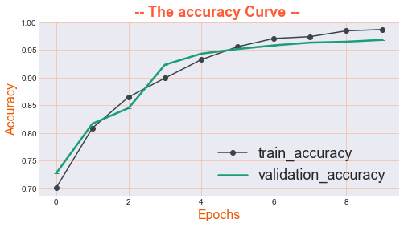
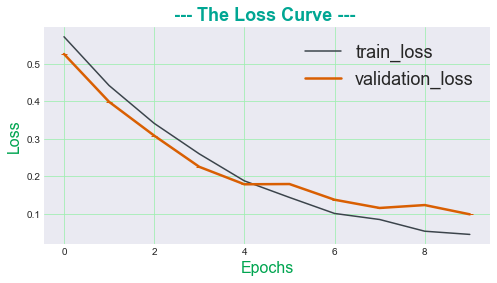
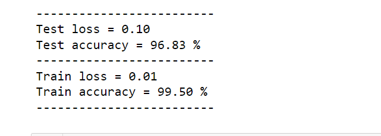
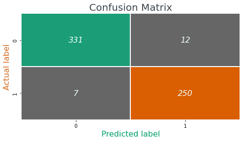
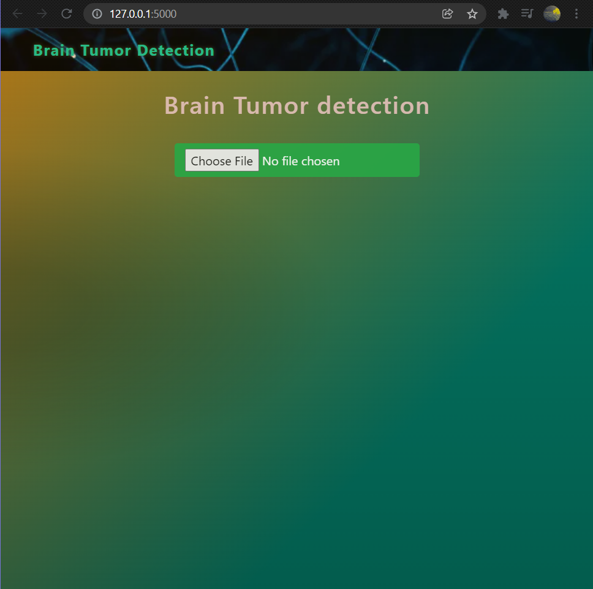
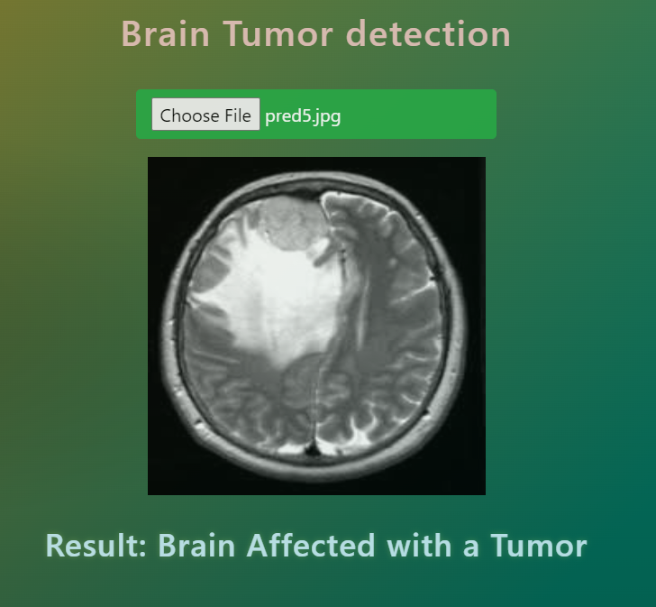
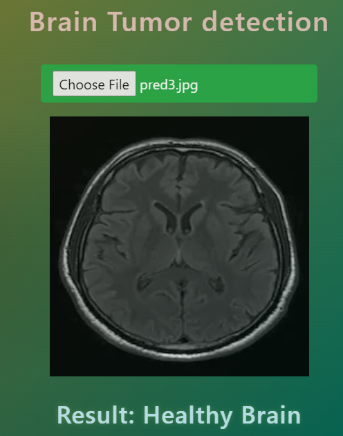

# Project: Brain tumor detection

# Overview
Detect and Classify Brain Tumor using CNN.
A system performing detection and classification by using Deep Learning Algorithms using Convolution-Neural Network (CNN).
The dataset contains 3 folders: **yes**, **no** and pred which contains **3060 Brain MRI** (Magnetic resonance imaging) **Images**. 
The link of the dataset from kaggle : [Download](https://www.kaggle.com/ahmedhamada0/brain-tumor-detection) 

# Dependencies / Frameworks
This project requires Python 3.8 or 3.9 and the following Python libraries installed:

* OpenCV-python
* Keras
* TensorFlow
* scikit-learn
* Matplotlib, seaborn and PIL
* Pandas & numpy
* Flask (For the Web APP)

# Results:
## 1. Loss & Accuracy curves:
* Accuracy:
   

* Loss

## 2. Evaluation of train and test data:

## 3. Confusion Matrix:

## Test Result from Flask APP

## The web app page:

### 1. Brain without Tumor:

### 2. Brain with Tumor:

## Credits
1. [GOMYCODE](https://gomycode.com/DZ-FR/home)
2. [Stackoverflow](https://stackoverflow.com)
3. [Kaggle](https://www.kaggle.com/)
4. [Krish naik youtube channel](https://www.youtube.com/playlist?list=PLZoTAELRMXVPGU70ZGsckrMdr0FteeRUi)
